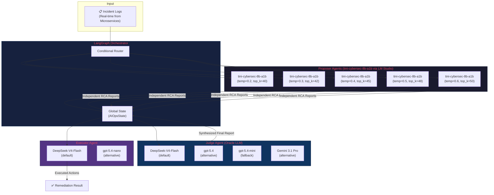
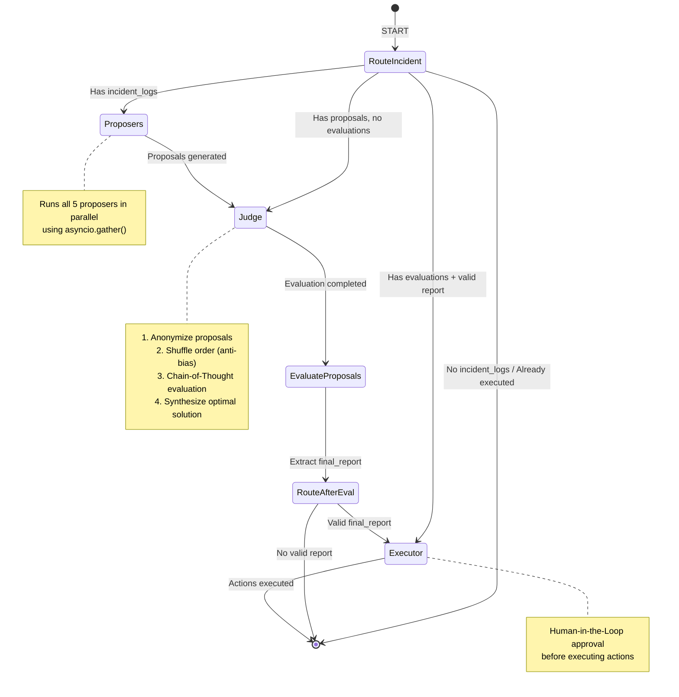
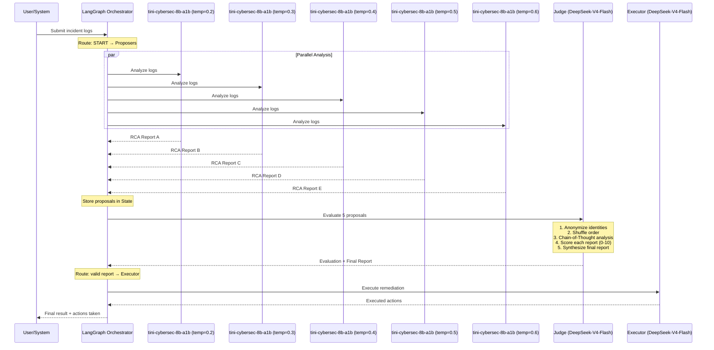
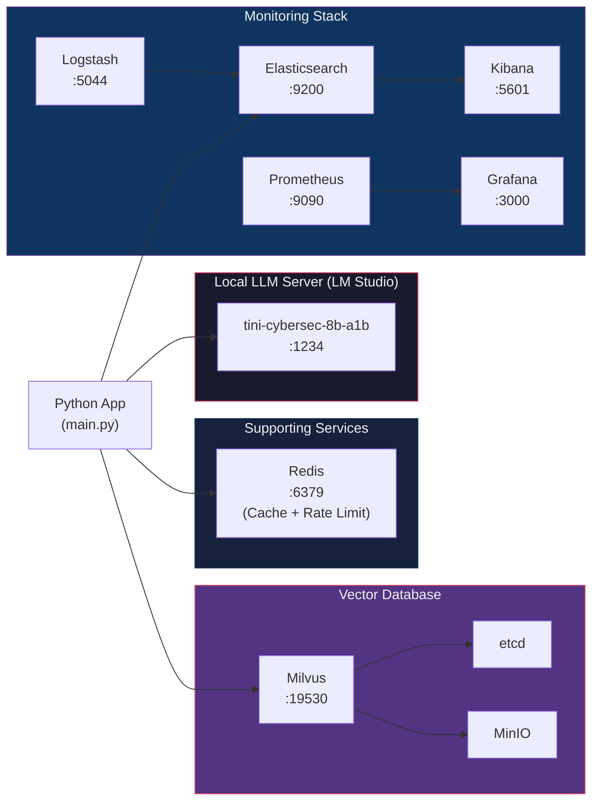
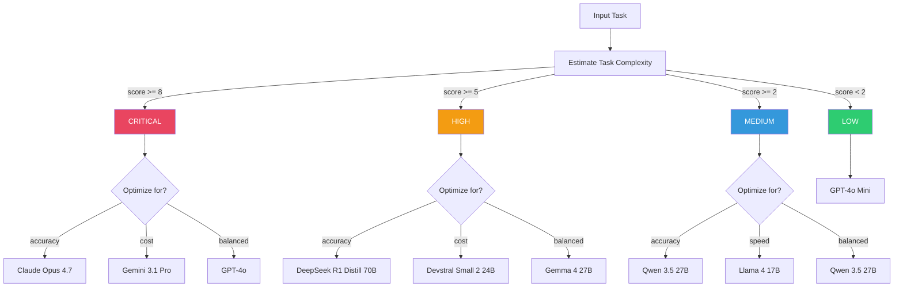
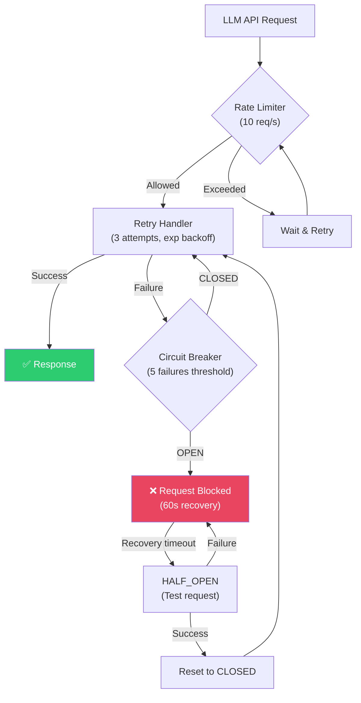

# System Architecture & Flow Diagrams

This document provides a comprehensive visual guide to the Multi-Agent AIOps System. It covers the overall architecture, the internal workflow managed by LangGraph, the step-by-step incident processing sequence, infrastructure deployment topology, the smart model routing logic, and the error handling resilience patterns.

---

## 1. High-Level Architecture

The system follows a **Mixture-of-Agents (MoA)** pattern with three distinct agent tiers. Incident logs enter through the LangGraph Orchestrator, which dispatches them to multiple Proposer agents running in parallel. Each Proposer independently analyzes the logs and produces a Root Cause Analysis (RCA) report. The Judge agent then evaluates all reports, filters out hallucinations, and synthesizes a single optimal solution. Finally, the Executor agent carries out the approved remediation actions using **gpt-5.4-nano** with Human-in-the-Loop CLI validation.

> **Key design principle:** By using multiple diverse LLMs as Proposers and a premium LLM as the Judge, the system reduces individual model biases and hallucinations through cross-validation.

**Component summary:**

| Component | Description | Models |
|-----------|-------------|--------|
| **Proposers** | 5 instances of the tini-cybersec-8b-a1b model running in parallel on a local LM Studio server. Each instance uses unique hyperparameters (temperature, top_k, top_p, repeat_penalty) to diversify analysis perspectives. | tini-cybersec-8b-a1b (x5 with varied parameters) |
| **Judge** | A single premium/local LLM that acts as an oracle. It does not analyze from scratch — instead it evaluates, compares, and synthesizes the Proposers' outputs. | DeepSeek-V4-Flash (default), gpt-5.4 (alternative), gpt-5.4-mini (fallback), Gemini 3.1 Pro (alternative) |
| **Executor** | A lightweight/local model that translates the Judge's final report into concrete remediation actions (e.g., API calls, scripts, restarts). | DeepSeek-V4-Flash (default), gpt-5.4-nano (alternative) |
| **Orchestrator** | LangGraph-based state machine that maintains a shared `AIOpsState` and routes data between agents using conditional edges. | — |

---

## 2. LangGraph Workflow (State Machine)

The workflow is implemented as a **LangGraph StateGraph** with conditional routing. The `route_incident_analysis` function at the entry point inspects the current state to decide which node to enter — this enables the graph to resume from any intermediate state (e.g., if proposals already exist, it skips directly to the Judge).

After the Judge produces an evaluation, a second router (`route_after_evaluation`) checks whether the final report contains valid data before deciding to proceed to the Executor or terminate.

**State fields** (defined in `orchestrator/state.py`):

| Field | Type | Description |
|-------|------|-------------|
| `incident_logs` | `str` | Raw incident log text from the monitoring system |
| `proposals` | `Annotated[list, operator.add]` | Accumulated RCA proposals from all Proposers (uses LangGraph reducer) |
| `evaluations` | `Annotated[list, operator.add]` | Judge evaluations (scores, reasoning, final report) |
| `final_report` | `Optional[IncidentReport]` | The synthesized optimal report after Judge evaluation |
| `executed_actions` | `Annotated[list, operator.add]` | List of remediation actions taken by the Executor |

**Routing logic** (defined in `orchestrator/router.py`):

1. **No `incident_logs`** → Terminate immediately (nothing to analyze)
2. **Has `proposals` but no `evaluations`** → Skip to Judge (proposals already generated in a previous run)
3. **Has `evaluations` + valid `final_report`** → Skip to Executor
4. **Has `executed_actions`** → Terminate (already completed)
5. **Default** → Start with Proposers

---

## 3. Incident Processing Sequence

This sequence diagram shows the end-to-end flow for a single incident, from log submission to remediation. The key insight is that **all 5 Proposers run concurrently** using `asyncio.gather()`, which significantly reduces total processing time compared to sequential execution.

The Judge applies several **anti-bias techniques** before evaluation:
- **Identity anonymization**: Proposer IDs are replaced with generic labels (Assistant A, B, C…) so the Judge cannot be influenced by model reputation
- **Order shuffling**: Proposals are randomly reordered to prevent position bias (first/last item bias)
- **Chain-of-Thought**: The Judge first analyzes the logs independently before reading any proposals, ensuring its own reasoning is not anchored by Proposer outputs

**Output structure** — the Judge produces an `Evaluation` object containing:
- `scores`: A list of scores (0–10) for each proposal, allowing comparison
- `best_proposal`: Index of the highest-scoring proposal
- `reasoning`: Detailed Chain-of-Thought explanation of the verdict
- `final_report`: An optimized `IncidentReport` that combines the best elements from all proposals

---

## 4. Infrastructure Deployment

The system leverages **LM Studio** to host the 5 proposer agent instances (utilizing the `tini-cybersec-8b-a1b` model) on a single local OpenAI-compatible server. 

The supporting services are deployed using **Docker Compose** and include the ELK Stack, Redis, Milvus vector database, Prometheus, and Grafana. The application connects directly to LM Studio via the `LOCAL_LLM_API_BASEURL` endpoint.

**Port mapping reference:**

| Service | Port | Purpose |
|---------|------|---------|
| LM Studio | 1234 | tini-cybersec-8b-a1b inference (OpenAI-compatible API) |
| Redis | 6379 | Response caching and API rate limiting |
| Elasticsearch | 9200 | Centralized log storage and search |
| Logstash | 5044 | Log processing pipeline |
| Kibana | 5601 | Log visualization dashboard |
| Milvus | 19530 | Vector database for semantic log search |
| Prometheus | 9090 | Metrics collection |
| Grafana | 3000 | Metrics visualization dashboard |

---

## 5. Model Router Decision Flow

The **Smart Model Router** (`agents/model_router.py`) dynamically selects the best model for any given task based on a complexity score. The score is computed from four factors:

1. **Input length** — longer inputs score higher (e.g., >10K chars = +3)
2. **Context length** — larger context windows score higher
3. **Reasoning requirement** — tasks needing deep reasoning get +3
4. **Accuracy requirement** — tasks needing high accuracy get +2

The total score maps to one of four complexity tiers: **LOW** (< 2), **MEDIUM** (2–4), **HIGH** (5–7), **CRITICAL** (≥ 8). Within each tier, the router further optimizes for cost, speed, accuracy, or a balanced weighted combination.

**Fallback behavior:** If the selected model fails (e.g., timeout or API error), the router automatically walks down a pre-defined fallback chain. For example, if **Claude Opus 4.7** fails at the CRITICAL tier, the chain proceeds to **GPT-4o → Gemini 3.1 Pro → DeepSeek R1 Distill → Devstral Small 2 → Gemma 4 → Qwen 3.5 → Llama 4 → GPT-4o Mini**.

---

## 6. Error Handling & Resilience

Every LLM API call in the system is wrapped with **three layers of protection**, applied as stacked decorators via `@with_all_protections()` in `agents/retry_handler.py`:

1. **Rate Limiter** (outermost) — Uses a Token Bucket algorithm to enforce a maximum of 10 requests/second, preventing API throttling and cost spikes
2. **Retry Handler** (middle) — Automatically retries failed requests up to 3 times with exponential backoff (1s → 2s → 4s), handling transient network errors and temporary API outages
3. **Circuit Breaker** (innermost) — After 5 consecutive failures, the circuit "opens" and blocks all requests for 60 seconds. This prevents cascade failures where a broken downstream service is repeatedly hammered with requests. After the recovery timeout, a single test request is sent (HALF_OPEN state) — if it succeeds, the circuit resets to CLOSED.

**Graceful degradation in the graph:** Beyond the per-request protections above, each LangGraph node function also implements its own graceful degradation. If the Proposers node fails entirely, it returns an empty `proposals` list rather than crashing the graph. The Judge node checks for empty proposals and returns an empty `evaluations` list. The Executor checks for a valid `final_report` before attempting any actions. This ensures the graph always terminates cleanly, even under partial failure conditions.
