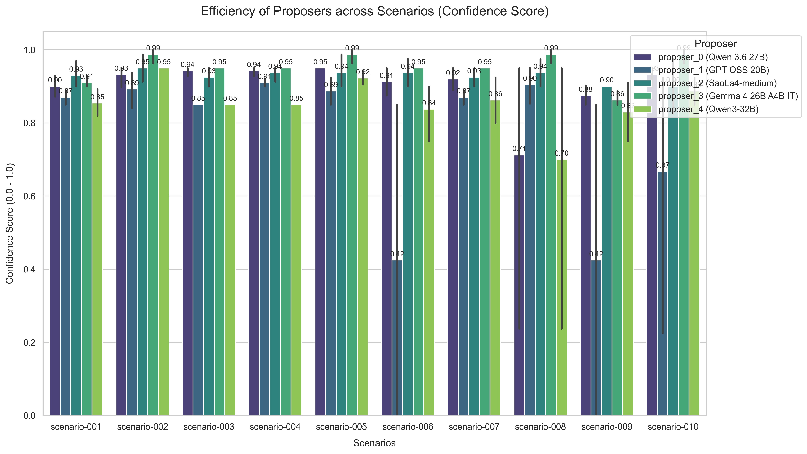

# AIOps Benchmarking and Scoring Guide

This document explains how the multi-agent system evaluates and scores the incident analysis reports generated by the different Proposer LLMs. 

## 1. The Evaluation Workflow

The evaluation process is orchestrated by the **Judge Agent**. Once an incident is processed and multiple Proposer LLMs generate their root cause analyses and solutions, the Judge Agent receives all the reports and evaluates them.

1. **Anonymization & Shuffling:** The Proposer LLMs' identities are anonymized (e.g., "Assistant A", "Assistant B") and their reports are shuffled to prevent any position or brand bias during evaluation.
2. **Chain-of-Thought Evaluation:** The Judge Agent independently analyzes the incident logs first, then critically evaluates each anonymized report.
3. **Scoring:** The Judge Agent assigns a score from **0.0 to 10.0** to each Proposer's report based on a strict set of metrics.
4. **Synthesis:** The Judge selects the best parts of the highest-scoring proposals to synthesize a final, optimal `IncidentReport`.

## 2. Core Scoring Metrics (Oracle Judge)

When running in standard mode, the Judge Agent acts as an expert IT infrastructure evaluator and scores proposals based on the following criteria:

* **Accuracy of Root Cause Analysis:** How accurately did the Proposer identify the underlying issue from the raw logs? Does the root cause match the evidence?
* **Feasibility and Effectiveness of Solution:** Are the proposed remediation steps technically sound? Will they actually solve the problem?
* **Level of Detail and Comprehensiveness:** Is the report well-structured, easy to read, and comprehensive without being overly verbose?
* **Confidence Score Alignment:** Does the confidence score provided by the Proposer align with the quality and certainty of their analysis?
* **Immediate Deployability:** Can the Executor safely apply the immediate remediation steps right now to mitigate the incident?

## 3. Advanced Evaluation Frameworks

The system is also integrated with industry-standard LLM evaluation frameworks. If enabled (`use_frameworks=True`), the Judge Agent calculates aggregated scores using the following libraries:

### DeepEval Metrics
* **Answer Relevancy:** Measures if the proposed solution directly addresses the identified root cause.
* **Faithfulness:** Ensures the report does not hallucinate and strictly relies on the provided incident logs.
* **Contextual Precision:** Evaluates how well the Proposer extracted the most relevant log lines to form their conclusion.

### RAGAS Metrics
* **Faithfulness:** Verifies the factual consistency of the generated solution against the incident log context.
* **Answer Relevancy:** Assesses how relevant the solution is to the "question" (the incident).
* **Context Precision:** Checks whether all the ground-truth relevant items were ranked highly in the context.

### Prometheus-Eval
Uses a custom, fine-grained rubric:
1. Root cause accuracy (0-30 points)
2. Solution feasibility (0-30 points)
3. Level of detail and comprehensiveness (0-20 points)
4. Confidence score provided (0-20 points)

### Reference-Guided Evaluation
If a standard runbook (reference solution) exists for a scenario, the system calculates a text similarity and semantic accuracy score comparing the LLM's proposed solution against the human-approved runbook.

## 4. Visualizing Scores

When you run `python benchmark.py --all`, the system automatically ingests these scores into Elasticsearch. You can track model performance over time via Grafana or Kibana by analyzing the `metadata.confidence_score` and the final Judge evaluation scores associated with each Proposer's logs (`aiops-reports` index).

You can also run `python visualize_benchmark.py` to generate the latest static visualization of the proposer efficiency across different scenarios.
