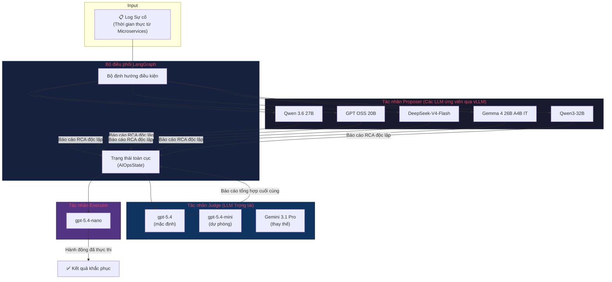
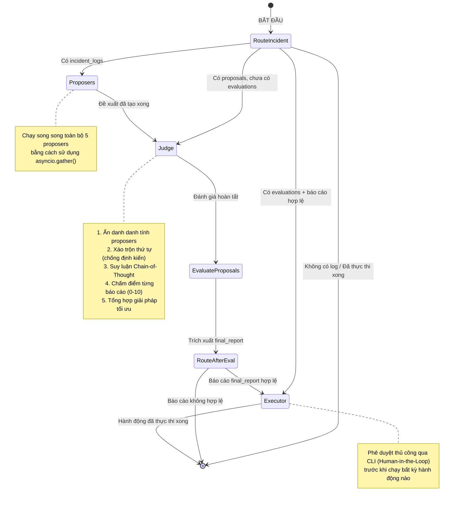
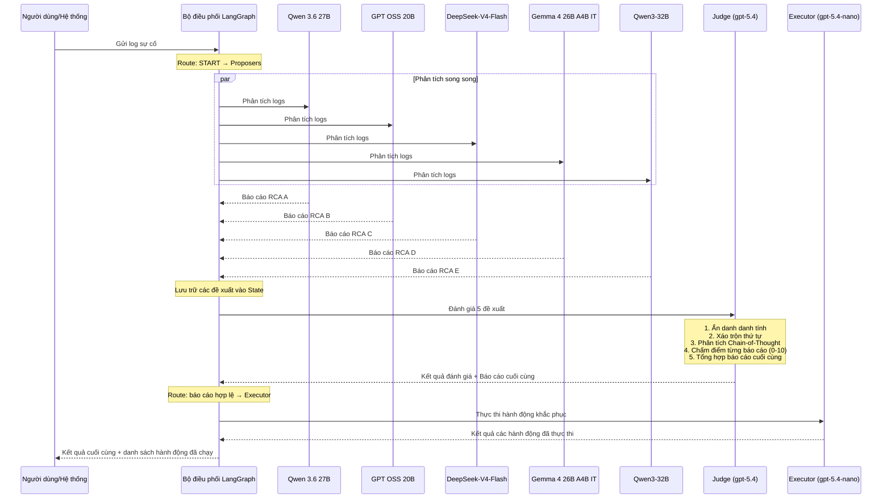
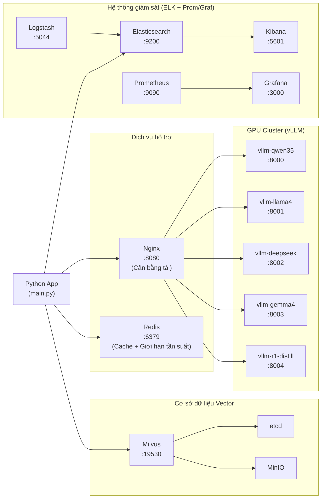
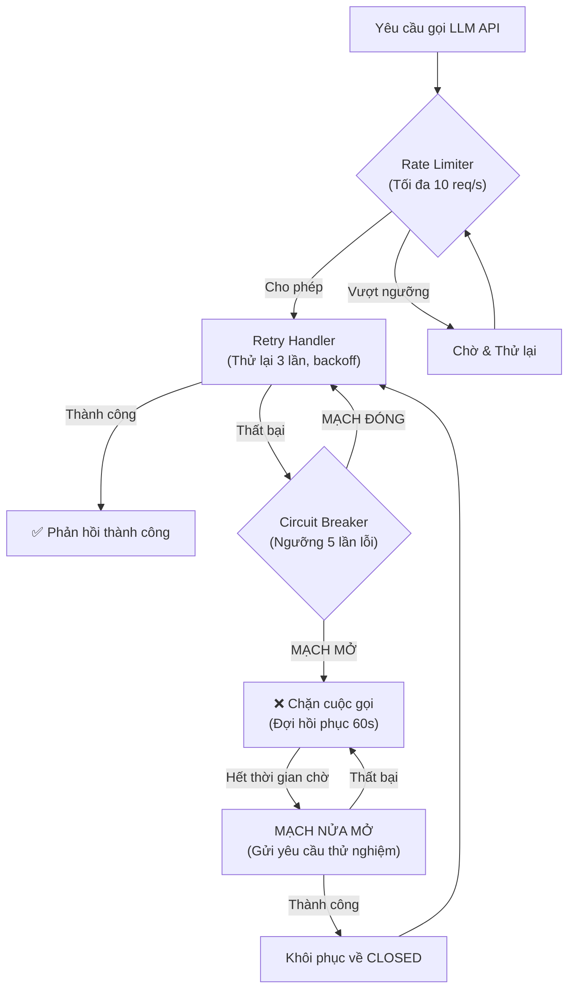

# Kiến trúc Hệ thống & Sơ đồ Luồng Hoạt động

Tài liệu này cung cấp hướng dẫn toàn diện về mặt kiến trúc của Hệ thống AIOps đa tác nhân. Tài liệu bao gồm kiến trúc mức cao, quy trình làm việc được quản lý bởi LangGraph, trình tự xử lý sự cố từng bước, cấu trúc triển khai hạ tầng, logic định tuyến mô hình và các cơ chế xử lý lỗi nâng cao.

---

## 1. Kiến trúc Tổng quan (High-Level Architecture)

Hệ thống tuân theo mô hình **Mixture-of-Agents (MoA)** với ba tầng tác nhân riêng biệt. Log sự cố đi vào bộ điều phối LangGraph, bộ điều phối này sẽ phân phối log tới nhiều tác nhân Proposer chạy song song. Mỗi Proposer độc lập phân tích log và đưa ra báo cáo Phân tích nguyên nhân gốc rễ (RCA). Tác nhân Judge sau đó đánh giá tất cả các báo cáo, loại bỏ thông tin sai lệch (hallucination) và tổng hợp thành một giải pháp tối ưu duy nhất. Cuối cùng, tác nhân Executor thực hiện các hành động khắc phục đã được phê duyệt.

> **Nguyên tắc thiết kế cốt lõi:** Bằng cách sử dụng nhiều LLM mã nguồn mở khác nhau làm Proposer và một LLM thương mại cao cấp làm Judge, hệ thống giảm thiểu tối đa định kiến và lỗi sai lệch của từng mô hình riêng lẻ thông qua cơ chế kiểm chéo chéo.

**Tóm tắt các thành phần:**

| Thành phần | Mô tả | Các mô hình sử dụng |
|------------|-------|---------------------|
| **Proposers** | 5 mô hình LLM mã nguồn mở được chạy cục bộ qua vLLM. Chúng hoạt động song song để đa dạng hóa góc nhìn phân tích. | Qwen 3.6 27B, GPT OSS 20B, DeepSeek-V4-Flash, Gemma 4 26B A4B IT, Qwen3-32B |
| **Judge** | Một LLM thương mại cao cấp đóng vai trò trọng tài. Mô hình này không phân tích log từ đầu mà đánh giá, đối chiếu và tổng hợp các đề xuất từ Proposers. | gpt-5.4 (mặc định), gpt-5.4-mini (dự phòng), Gemini 3.1 Pro (thay thế) |
| **Executor** | Mô hình siêu nhẹ giúp chuyển đổi báo cáo cuối cùng của Judge thành các lệnh thực thi cụ thể (như gọi API, chạy script, khởi động lại dịch vụ). | gpt-5.4-nano |
| **Orchestrator** | Máy trạng thái (state machine) dựa trên LangGraph giúp duy trì trạng thái chia sẻ `AIOpsState` và điều hướng dữ liệu giữa các tác nhân thông qua các liên kết điều kiện. | — |

---

## 2. Quy trình LangGraph (Máy trạng thái)

Quy trình làm việc được triển khai dưới dạng một **LangGraph StateGraph** với cơ chế định tuyến điều kiện. Hàm `route_incident_analysis` tại điểm bắt đầu kiểm tra trạng thái hiện tại để quyết định nút (node) nào sẽ được chạy tiếp theo — điều này cho phép quy trình có thể tiếp tục từ bất kỳ trạng thái trung gian nào (ví dụ: nếu các đề xuất RCA đã tồn tại, nó sẽ bỏ qua Proposer và chuyển thẳng đến Judge).

Sau khi Judge đưa ra kết quả đánh giá, bộ định tuyến thứ hai (`route_after_evaluation`) sẽ kiểm tra xem báo cáo cuối cùng có hợp lệ hay không trước khi quyết định chuyển đến Executor hay kết thúc.

**Các trường dữ liệu trạng thái (State fields)** (định nghĩa trong `orchestrator/state.py`):

| Trường | Kiểu dữ liệu | Mô tả |
|--------|--------------|-------|
| `incident_logs` | `str` | Nội dung log sự cố thô từ hệ thống giám sát |
| `proposals` | `Annotated[list, operator.add]` | Danh sách các đề xuất RCA được gom lại từ tất cả Proposers (sử dụng LangGraph reducer) |
| `evaluations` | `Annotated[list, operator.add]` | Các đánh giá của Judge (điểm số, suy luận, báo cáo cuối cùng) |
| `final_report` | `Optional[IncidentReport]` | Báo cáo tối ưu được tổng hợp lại sau khi Judge đánh giá |
| `executed_actions` | `Annotated[list, operator.add]` | Danh sách các hành động khắc phục đã được Executor thực thi |

---

## 3. Trình tự Xử lý Sự cố (Incident Processing Sequence)

Sơ đồ trình tự này mô tả luồng xử lý từ đầu đến cuối đối với một sự cố, từ khi gửi log đến khi khắc phục xong. Điểm mấu chốt là **tất cả 5 Proposers hoạt động đồng thời** bằng `asyncio.gather()`, giúp giảm đáng kể tổng thời gian xử lý so với việc chạy tuần tự.

Tác nhân Judge áp dụng một số **kỹ thuật chống định kiến (anti-bias)** trước khi đánh giá:
- **Ẩn danh danh tính**: Tên các Proposer được thay thế bằng các nhãn chung (Assistant A, B, C…) để Judge không bị ảnh hưởng bởi danh tiếng của mô hình.
- **Xáo trộn thứ tự**: Các đề xuất được sắp xếp ngẫu nhiên để tránh định kiến về vị trí hiển thị (lỗi ưu tiên các mục đầu tiên/cuối cùng).
- **Chain-of-Thought độc lập**: Judge tự phân tích log trước khi đọc bất kỳ đề xuất nào từ Proposers, đảm bảo suy luận riêng của nó không bị định hướng trước.

---

## 4. Cấu trúc Triển khai Hạ tầng

Hệ thống được triển khai bằng **Docker Compose** với các thành phần sau. Có hai hồ sơ cấu hình có sẵn:
- **Full profile** (`docker-compose.yml`): Chạy toàn bộ 5 container vLLM, ELK Stack, Milvus, Prometheus, Grafana — dùng cho môi trường sản xuất đa GPU.
- **Light profile** (`docker-compose.light.yml`): Chỉ chạy 1 container vLLM + Redis — phù hợp cho máy cá nhân hoặc phòng lab chỉ có 1 GPU.

---

## 5. Xử lý Lỗi & Khả năng Chịu lỗi (Resilience)

Mỗi cuộc gọi API đến LLM trong hệ thống đều được bảo vệ bởi **ba lớp chịu lỗi**, được áp dụng dưới dạng decorator thông qua `@with_all_protections()` trong `agents/retry_handler.py`:

1. **Giới hạn tần suất (Rate Limiter)** (ngoài cùng) — Sử dụng thuật toán Token Bucket để giới hạn tối đa 10 yêu cầu/giây, tránh bị khóa API Gateway và kiểm soát chi phí.
2. **Cơ chế thử lại (Retry Handler)** (ở giữa) — Tự động thử lại cuộc gọi bị lỗi tối đa 3 lần với cơ chế giảm tốc lũy thừa (exponential backoff) (1s → 2s → 4s), xử lý các lỗi mạng tạm thời hoặc nghẽn API.
3. **Bộ ngắt mạch (Circuit Breaker)** (trong cùng) — Sau 5 lần thất bại liên tiếp, mạch sẽ chuyển sang trạng thái "MỞ" (OPEN) và chặn toàn bộ các yêu cầu trong vòng 60 giây tiếp theo để tránh làm sập hệ thống phía sau. Sau thời gian chờ, mạch sẽ cho phép một yêu cầu thử nghiệm đi qua (HALF_OPEN) — nếu thành công, mạch sẽ đóng lại (CLOSED).

